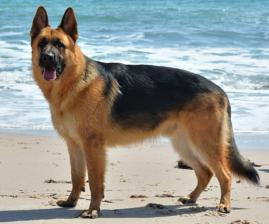
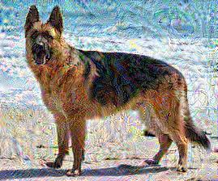

# hamartaa
adversarially transform images to interfere with image recognition algorithms

hamartaa is the anglicization of the Finnish word for blur.

## Example:

### Results after hamartaa on African Elephant:

Final prediction: Class 385 with 1.0000 confidence  
Attack successful  
True class: African elephant, Loxodonta africana 
Predicted class: Indian elephant, Elephas maximus

->

### Results after hamartaa on German Shephard
Final prediction: Class 270 with 1.0000 confidence  
Attack successful  
True class: German shepherd, German shepherd dog, German police dog, alsatian  
Predicted class: white wolf, Arctic wolf, Canis lupus tundrarum  

->

