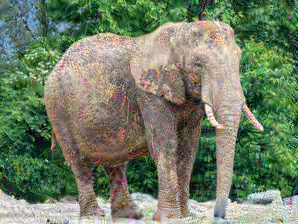

# hamartaa
adversarially transform images to interfere with image recognition algorithms

hamartaa is the anglicization of the Finnish word for blur.

## Example:

### Results after hamaarta:

Final prediction: Class 385 with 1.0000 confidence
Attack successful
True class: African elephant, Loxodonta africana
Predicted class: Indian elephant, Elephas maximus

->

